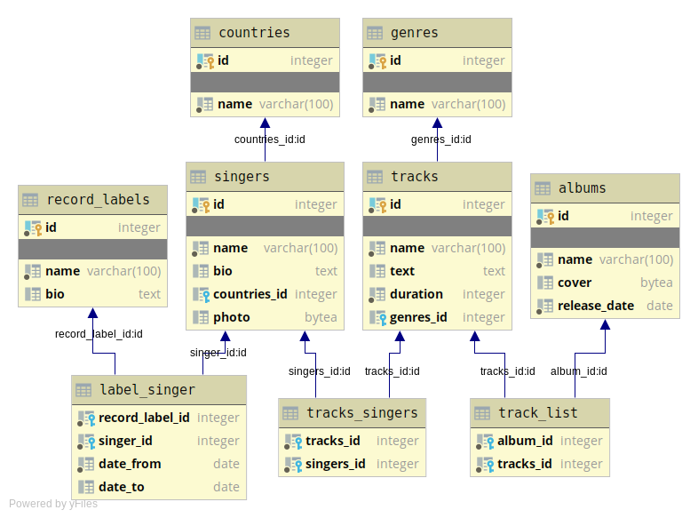

# Схема базы данных и описание таблиц

#### Отчёты по всем лабораторным работам:

[ссылка на отчет](https://www.overleaf.com/7676652532xsrtfhzrmsbg)

#### Отчёты по курсовому проекту:

[ссылка на отчет](https://www.overleaf.com/read/qbmjzjvqcrxt)

## Основные таблицы

Все таблицы, описанные в данном пункте, также имеют поле уникального ключа -- идентификатора.

### *record_labels*

Таблица содержит информацию о музыкальных лейблах.

+ ***name*** -- имя лейбла, не может принимать значение NULL, повторяться не должно
+ ***bio*** -- информация/история лейбла

### *singers*

Таблица содержит информацию об исполнителях.

+ ***name*** -- имя исполнителя, не может принимать значение NULL, повторяться не должно
+ ***bio*** -- биография исполнителя
+ ***countries_id*** -- идентификатор страны происхождения, ссылается на запись в таблице *countries*"
+ ***photo*** -- фотография исполнителя

### *tracks*

Содержится информация о всех композициях библиотеки (базы данных).

+ ***name*** -- название композиции, не может быть NULL, повторяться не должно
+ ***text*** -- текст композиции, если есть
+ ***genres_id*** -- идентификатор жанра, ссылается на запись в таблице *genres*
+ ***duration*** -- длительность композиции в секундах, должна быть > 0

### *albums*

Таблица содержит информацию о всех альбомах библиотеки.

+ ***name*** -- название альбома, не может принимать значение NULL, повторяться не должно
+ ***cover*** -- обложка альбома
+ ***release_date*** -- дата релиза, не может принимать значение NULL

## Таблицы для организации связей

Все таблицы, описанные в данном пункте, не имеют поле идентификатора, т.к. в этом нет необходимости.

### *label_singers*

В годы активной деятельности исполнитель может сотрудничать не с одним муз. лейблом. Поэтому эта таблица содержит записи
какой лейбл с каким артистом работа и в какое время.

+ ***record_label_id*** -- идентификатор музыкального лейбла, ссылается на запись в таблице *record_labels*, не может
  принимать значение NULL
+ ***singer_id*** -- идентификатор исполнителя, ссылается на запись в таблице *singers*, не может принимать значение
  NULL
+ ***date_from*** -- дата начала сотрудничества артиста и музыкального лейбла, не может принимать значение NULL
+ ***date_to*** -- дата завершения сотрудничества, если исполнитель в данное время работает с лейблом, то принимает
  значение NULL.

### *tracks_singers*

У каждой композиции есть исполнитель, у одного исполнителя много композиций, у композиции может быть много исполнителей.

+ ***track_id*** -- идентификатор композиции, ссылается на запись в таблице *tracks*, не может принимать значение NULL
+ ***singers_id*** -- идентификатор исполнителя, ссылается на запись в таблице *singers*, не может принимать значение
  NULL

### *track_list*

У каждого альбома может быть одна или несколько композиций, композиция может находится в одном или нескольких альбомах (
например, deluxe edition).

+ ***album_id*** -- идентификатор альбома, ссылается на запись в таблице *albums*, не может принимать значение NULL
+ ***track_id*** -- идентификатор композиции, ссылается на запись в таблице *tracks*, не может принимать значение NULL

## Дополнительные таблицы

Нижеперечисленные таблицы используются для того, чтобы контролировать данные, которые вводятся в поля таблиц. В каждой
из них, помимо описанного поля, имеется поле идентификатора

### *countries*

Таблица содержит список стран.

+ ***name*** -- название страны, не может быть NULL, повторяться не должно

### *genres*

Таблица содержит список жанров.

+ ***name*** -- название жанра, не может быть NULL, повторяться не должно